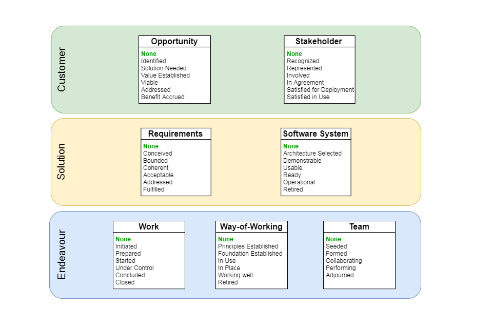
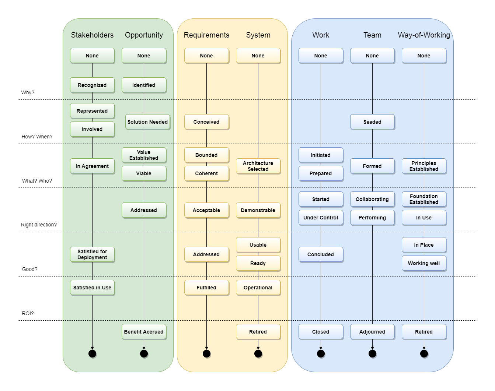

OMG Essence is one way to understand state of software project and find actions to drive it forward.

### Diagrams

essence.drawio file have ready to use diagrams

"None" state was added to highlight that all alphas start from it.

Drawio application could be used to modify diagrams. 

#### Overview

Overview could be used to depict current state of project. E.g. project status page could have screenshot with latest version, and updated every iteration.
 

#### Plan

Plan could be used to depict expected software development process and important synchronization steps between alphas. Usually that plan have to be modified for each project.

Essence standard have several good examples at the end for Discovery, Maintenance, etc projects/phases.

### checklist

[Alphas checklist](cl-status.md)

It is advised to fill checkboxes of next state, only if previous is completed. E.g. for Work, fill checkboxes of Started, only all checkboxes of Prepared are checked.
 

### Sources

https://www.omg.org/spec/Essence/1.2/PDF

https://www.omg.org/spec/Essence/

