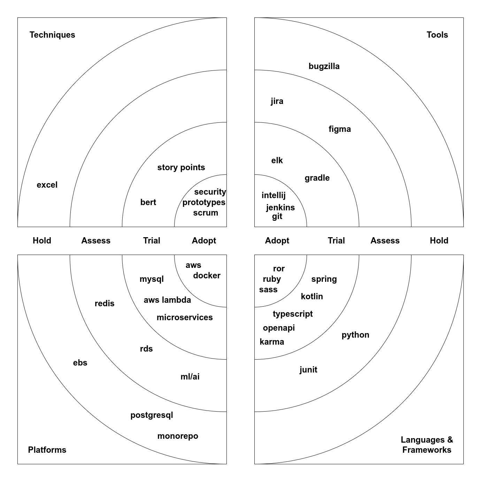

# Technology radar

Reflect on what technologies are currently used in the project/team.

Could be used for:
- discussions on things that could be removed or adopted,
- interviews, to give overview about used technologies and expectations,
- audit of technological portfolio,
- convince teams to use stable and safe technologies or to encourage try new ones.

This is an easily editable template for drafting or group work.

[techradar.drawio](techradar.drawio) <- edit this file in diagrams.net

## Examples of radars

https://www.thoughtworks.com/radar

https://www.aoe.com/techradar/index.html

https://opensource.zalando.com/tech-radar/